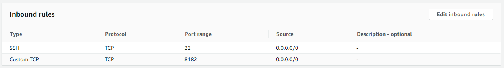

## graph-notebook

Python package integrating Jupyter notebooks with various graph-stores including
[Apache TinkerPop](https://tinkerpop.apache.org/) and [RDF SPARQL](https://www.w3.org/TR/rdf-sparql-query/).

## Requirements
- Python 3.6
- Jupyter Notebook

## Introduction
The graph-notebook provides a way to interact using a Jupyter notebook with any graph database that follows the Gremlin Server or RDF HTTP protocols. These databases could be running locally on your laptop, in a private data center or in the cloud. This project was initially created as a way to work with Amazon Neptune but is not limited to that database engine. For example you can connect to a Gremlin Server running on your laptop using this solution. The instructions below describe the process for connecting to Amazon Neptune. We encourage others to contribute configurations they find useful. There is an [`additional-databases`](additional-databases) folder where such information can be found. We have already provided instructions for establishing the Gremlin Server connection.

## Installation

```
# install the package
pip install graph-notebook

# install and enable the visualization widget
jupyter nbextension install --py --sys-prefix graph_notebook.widgets
jupyter nbextension enable  --py --sys-prefix graph_notebook.widgets

# copy static html resources
python -m graph_notebook.static_resources.install
python -m graph_notebook.nbextensions.install

# copy premade starter notebooks
python -m graph_notebook.notebooks.install --destination /notebook/destination/dir  

# start jupyter
jupyter notebook /notebook/destination/dir
```

## Configuration

In order to connect to your graph database, you have three configuration options.

1. Change the host setting in your opened Jupyter notebook by running the following in a notebook cell:

```
%graph_notebook_host you-endpoint-here
```

2. Change your configuration entirely grabbing the current configuration, making edits, and saving it to your notebook by running the following cells:

```
# 1. print your configuration
%graph_notebook_config

# default config will be printed if nothing else is set:
{
    "host": "change-me",
    "port": 8182,
    "auth_mode": "DEFAULT",
    "iam_credentials_provider_type": "ROLE",
    "load_from_s3_arn": "",
    "ssl": true,
    "aws_region": "us-east-1"
}

# 2. in a new cell, change the configuration by using %%graph_notebook_config (note the two leading %% instead of one)
%%graph_notebook_config
{
  "host": "changed-my-endpoint",
  "port": 8182,
  "auth_mode": "DEFAULT",
  "iam_credentials_provider_type": "ENV",
  "load_from_s3_arn": "",
  "ssl": true,
  "aws_region": "us-east-1"
}
```

3. Store a configuration under ~/graph_notebook_config.json
```
echo "{
  "host": "changed-my-endpoint",
  "port": 8182,
  "auth_mode": "DEFAULT",
  "iam_credentials_provider_type": "ENV",
  "load_from_s3_arn": "",
  "ssl": true,
  "aws_region": "us-east-1"
}" >> ~/graph_notebook_config.json
```

### Connecting to a local graph store
As mentioned in the introduction, it is possible to connect [`graph-notebook`](src/graph_notebook) to a graph database running on your local machine, an example being Gremlin Server. There are additional instructions regarding the use of local servers in the [`additional-databases`](additional-databases) folder.

### Connecting a local graph-notebook to Amazon Neptune (first-time setup)
When using graph-notebook locally to connect to an Amazon Neptune database for the first time, there are a couple of additional steps. This section assumes that you've already installed & configured [graph-notebook](#installation) locally.

Amazon Neptune DB clusters can only be created in an Amazon Virtual Private Cloud (VPC).  One way to connect to Amazon Neptune from outside of the VPC is to set up an Amazon EC2 instance as a proxy server within the same VPC. With this approach, you will also want to set up an SSH tunnel to securely forward traffic to the VPC.  Please note that this wiki is not an official recommendation on network setups as there are many ways to connect to Amazon Neptune from outside of the VPC, such as setting up a load balancer or VPC peering.

#### Part 1: Set up a EC2 proxy server.
Launch an [Amazon EC2](https://aws.amazon.com/ec2/) instance located in the same region as your Neptune cluster. In terms of configuration, a standard Amazon Linux AMI can be used.  Since this is a proxy server, you can choose the lowest resource settings.  

Make sure the EC2 instance is in the same VPC group as your Neptune cluster. To find the VPC group for your Neptune cluster, check the console under [Neptune](https://console.aws.amazon.com/neptune/home) > Subnet groups. The instance's security group needs to be able to send and receive on port 22 for SSH and port 8182 for Neptune.  See below for an example security group setup.  



Lastly, make sure you save the key-pair file (.pem) and note the directory for use in the next step.

#### Part 2: Set up an SSH tunnel.
This step can vary depending on if you are running Windows or Mac.

<b>Windows</b>

First, modify your hosts file as an Administrator (C:\Windows\System32\drivers\etc\hosts) to map localhost to your Neptune endpoint:

127.0.0.1   localhost   your-Neptune-endpoint-here

Next, open Command Prompt as an Administrator and navigate to the directory where you saved the EC2 key-pair file.  Run the following command:

`ssh -i keypairfilename.pem ec2-user@yourec2instanceendpoint -N -L 8182:yourneptuneendpoint:8182`

The -N flag will log you in instead of prompting for the information already included as part of your command when logging into EC2. An initial successful connection will ask you if you want to continue connecting? Type yes and enter.  

To test the success of your local graph-notebook connection to Amazon Neptune, open a browser and navigate to:

`https://yourneptunendpoint:8182/status` 

You should see a status report indicating the health of your cluster like so:

`{"status":"healthy","startTime":"Wed Nov 04 23:24:44 UTC 2020","dbEngineVersion":"1.0.3.0.R1","role":"writer","gremlin":{"version":"tinkerpop-3.4.3"},"sparql":{"version":"sparql-1.1"},"labMode":{"ObjectIndex":"disabled","DFEQueryEngine":"disabled","ReadWriteConflictDetection":"enabled"}}`

Now, you should be able to run queries from your local Jupyter graph notebook to your Neptune clusters!  When you're ready to close the connection, use Ctrl+D to exit.


## Authentication

If you are running a SigV4 authenticated endpoint, ensure that the config field `iam_credentials_provider_type` is set
to `ENV` and that you have set the following environment variables:

- AWS_ACCESS_KEY_ID
- AWS_SECRET_ACCESS_KEY
- AWS_REGION
- AWS_SESSION_TOKEN (OPTIONAL. Use if you are using temporary credentials)


## Security

See [CONTRIBUTING](https://github.com/aws/graph-notebook/blob/main/CONTRIBUTING.md) for more information.

## License

This project is licensed under the Apache-2.0 License.
