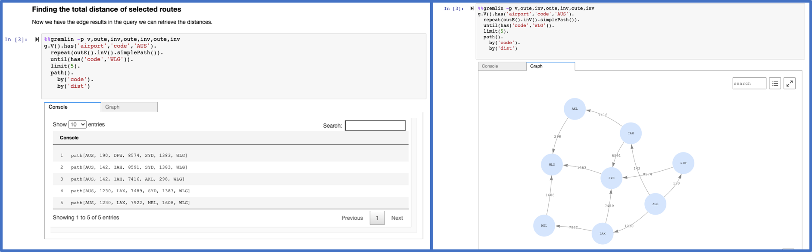

# Graph Notebook: easily query and visualize graphs

The graph notebook provides an easy way to interact with graph databases using Jupyter notebooks. Using this open-source Python package, you can connect to any graph database that supports the [Apache TinkerPop](https://tinkerpop.apache.org/), [openCypher](https://github.com/opencypher/openCypher) or the [RDF SPARQL](https://www.w3.org/TR/rdf-sparql-query/) graph models. These databases could be running locally on your desktop or in the cloud. Graph databases can be used to explore a variety of use cases including [knowledge graphs](https://aws.amazon.com/neptune/knowledge-graphs-on-aws/) and [identity graphs](https://aws.amazon.com/neptune/identity-graphs-on-aws/).


## Visualizing Gremlin queries



## Visualizing openCypher queries


## Visualizing SPARQL queries


Instructions for connecting to the following graph databases:

|             Endpoint            |       Graph model       |   Query language    |
| :-----------------------------: | :---------------------: | :-----------------: |
|[Gremlin Server](#gremlin-server)|     property graph      |       Gremlin       |
|    [Blazegraph](#blazegraph)    |            RDF          |       SPARQL        |
|[Amazon Neptune](#amazon-neptune)|  property graph or RDF  |  Gremlin, openCypher, or SPARQL  |
|         [Neo4J](#neo4j)         |     property graph      |       Cypher        |

We encourage others to contribute configurations they find useful. There is an [`additional-databases`](https://github.com/aws/graph-notebook/blob/main/additional-databases) folder where more information can be found.

## Features

### Notebook cell 'magic' extensions in the IPython 3 kernel

`%%sparql` - Executes a SPARQL query against your configured database endpoint. [Documentation](https://docs.aws.amazon.com/neptune/latest/userguide/notebooks-magics.html#notebooks-cell-magics-sparql)

`%%gremlin` - Executes a Gremlin query against your database using web sockets. The results are similar to those a Gremlin console would return. [Documentation](https://docs.aws.amazon.com/neptune/latest/userguide/notebooks-magics.html#notebooks-cell-magics-gremlin)

`%%opencypher` or `%%oc` Executes an openCypher query against your database. [Documentation](https://docs.aws.amazon.com/neptune/latest/userguide/notebooks-magics.html#notebooks-cell-magics-opencypher)

`%%graph_notebook_config` - Sets the executing notebook's database configuration to the JSON payload provided in the cell body.

`%%graph_notebook_vis_options` - Sets the executing notebook's [vis.js options](https://visjs.github.io/vis-network/docs/network/physics.html) to the JSON payload provided in the cell body.

`%%neptune_ml` - Set of commands to integrate with NeptuneML functionality, as described [here](https://docs.aws.amazon.com/neptune/latest/userguide/notebooks-magics.html#notebooks-line-magics-neptune_ml). [Documentation](https://docs.aws.amazon.com/neptune/latest/userguide/machine-learning.html)

**TIP** :point_right: `%%sparql`, `%%gremlin`, and `%%oc` share a [suite of common arguments](https://docs.aws.amazon.com/neptune/latest/userguide/notebooks-magics.html#notebook-magics-query-args) that be used to customize the appearance of rendered graphs. Example usage of these arguments can also be found in the sample notebooks under [02-Visualization](https://github.com/aws/graph-notebook/tree/main/src/graph_notebook/notebooks/02-Visualization).

**TIP** :point_right: There is syntax highlighting for language query magic cells to help you structure your queries more easily.

#### Notebook line 'magic' extensions in the IPython 3 kernel

`%gremlin_status` - Obtain the status of Gremlin queries. [Documentation](https://docs.aws.amazon.com/neptune/latest/userguide/gremlin-api-status.html)

`%sparql_status` - Obtain the status of SPARQL queries. [Documentation](https://docs.aws.amazon.com/neptune/latest/userguide/sparql-api-status.html)

`%opencypher_status` or `%oc_status` - Obtain the status of openCypher queries. [Documentation](https://docs.aws.amazon.com/neptune/latest/userguide/access-graph-opencypher-status.html)

`%load` - Generate a form to submit a bulk loader job. [Documentation](https://docs.aws.amazon.com/neptune/latest/userguide/bulk-load.html)

`%load_ids` - Get ids of bulk load jobs. [Documentation](https://docs.aws.amazon.com/neptune/latest/userguide/load-api-reference-status-examples.html)

`%load_status` - Get the status of a provided `load_id`. [Documentation](https://docs.aws.amazon.com/neptune/latest/userguide/load-api-reference-status-examples.html)

`%cancel_load` - Cancels a bulk load job. You can either provide a single `load_id`, or specify `--all-in-queue` to cancel all queued (and not actively running) jobs. [Documentation](https://docs.aws.amazon.com/neptune/latest/userguide/load-api-reference-cancel.html)

`%neptune_ml` - Set of commands to integrate with NeptuneML functionality, as described [here](https://docs.aws.amazon.com/neptune/latest/userguide/notebooks-magics.html#notebooks-cell-magics-neptune_ml). You can find a set of tutorial notebooks [here](https://github.com/aws/graph-notebook/tree/main/src/graph_notebook/notebooks/04-Machine-Learning).
[Documentation](https://docs.aws.amazon.com/neptune/latest/userguide/machine-learning.html)

`%status` - Check the Health Status of the configured host endpoint. [Documentation](https://docs.aws.amazon.com/neptune/latest/userguide/access-graph-status.html)

`%seed` - Provides a form to add data to your graph, using sets of insert queries instead of a bulk loader. Sample RDF and Property Graph data models are provided with this command. Alternatively, you can select a language type and provide a file path(or a directory path containing one or more of these files) to load the queries from.

`%stream_viewer` - Interactively explore the Neptune CDC stream (if enabled)

`%graph_notebook_config` - Returns a JSON payload that contains connection information for your host.

`%graph_notebook_host` - Set the host endpoint to send queries to.

`%graph_notebook_version` - Print the version of the `graph-notebook` package

`%graph_notebook_vis_options` - Print the Vis.js options being used for rendered graphs

**TIP** :point_right: You can list all the magics installed in the Python 3 kernel using the `%lsmagic` command.

**TIP** :point_right: Many of the magic commands support a `--help` option in order to provide additional information.

## Example notebooks

This project includes many example Jupyter notebooks. It is recommended to explore them. All of the commands and features supported by `graph-notebook` are explained in detail with examples within the sample notebooks. You can find them  [here](./src/graph_notebook/notebooks/). As this project has evolved, many new features have been added. If you are already familiar with graph-notebook but want a quick summary of new features added, a good place to start is the Air-Routes notebooks in the [02-Visualization](./src/graph_notebook/notebooks/02-Visualization) folder.

## Keeping track of new features

It is recommended to check the [ChangeLog.md](ChangeLog.md) file periodically to keep up to date as new features are added.

## Prerequisites

You will need:

* [Python](https://www.python.org/downloads/) 
  * For JupyterLab 4x Version: 3.9.x-3.11.x
  * For JupyterLab 3x Version: 3.9.x-3.10.14 
* A graph database that provides one or more of:
  * A SPARQL 1.1 endpoint
  * An Apache TinkerPop Gremlin Server compatible endpoint
  * An endpoint compatible with openCypher
  
## Installation

Follow the instructions for either Jupyter Classic Notebook or JupyterLab based on your requirements.


### Jupyter Classic Notebook

``` bash
pip install graph-notebook

# Enable the visualization widget
jupyter nbclassic-extension enable  --py --sys-prefix graph_notebook.widgets

# copy static html resources
python -m graph_notebook.static_resources.install
python -m graph_notebook.nbextensions.install

# copy premade starter notebooks
python -m graph_notebook.notebooks.install --destination ~/notebook/destination/dir

# create nbconfig file and directory tree, if they do not already exist
mkdir ~/.jupyter/nbconfig
touch ~/.jupyter/nbconfig/notebook.json

# start jupyter notebook
python -m graph_notebook.start_notebook --notebooks-dir ~/notebook/destination/dir
```

### Jupyter Lab

Graph-notebook has been upgraded to support JupyterLab 4.x since version 5.0.0, featuring a modernized widget architecture and improved compatibility.

Choose your installation based on your JupyterLab version requirements.


### JupyterLab 4.x (Recommended)

``` bash
# install jupyterlab
pip install "jupyterlab>=4.3.5,<5"

# Install the latest version with JupyterLab 4.x support
pip install graph-notebook

# copy premade starter notebooks
python -m graph_notebook.notebooks.install --destination ~/notebook/destination/dir

# start jupyterlab
python -m graph_notebook.start_jupyterlab --jupyter-dir ~/notebook/destination/dir
```

### JupyterLab 3.x (Legacy)

``` bash

# install jupyterlab
pip install "jupyterlab>=3,<4"

# Install legacy version for JupyterLab 3.x compatibility
pip install "graph-notebook<5.0.0"

# copy premade starter notebooks
python -m graph_notebook.notebooks.install --destination ~/notebook/destination/dir

# start jupyterlab
python -m graph_notebook.start_jupyterlab --jupyter-dir ~/notebook/destination/dir
```

#### Loading magic extensions in JupyterLab

When attempting to run a line/cell magic on a new notebook in JupyterLab, you may encounter the error:

``` bash
UsageError: Cell magic `%%graph_notebook_config` not found.
```

To fix this, run the following command, then restart JupyterLab.

``` bash
python -m graph_notebook.ipython_profile.configure_ipython_profile
```

Alternatively, the magic extensions can be manually reloaded for a single notebook by running the following command in any empty cell.

``` bash
%load_ext graph_notebook.magics
```

## Upgrading an existing installation

``` bash
# upgrade graph-notebook
pip install graph-notebook --upgrade
```

After the above command completes, rerun the commands given at [Jupyter Classic Notebook](#jupyter-classic-notebook) or [JupyterLab 3.x](#jupyterlab-3x) based on which flavour is installed.

## Connecting to a graph database

Configuration options can be set using the `%graph_notebook_config` magic command. The command accepts a JSON object as an argument. The JSON object can contain any of the configuration options listed below. The command can be run multiple times to change the configuration. The configuration is stored in the notebook's metadata and will be used for all subsequent queries.

| Configuration Option | Description | Default Value | Type |
| --- | --- | --- | --- |
| auth_mode | The authentication mode to use for Amazon Neptune connections | DEFAULT | string |
| aws_region | The AWS region to use for Amazon Neptune connections | your-region-1 | string |
| host | The host url to form a connection with | localhost | string |
| load_from_s3_arn | The ARN of the S3 bucket to load data from [Amazon Neptune only] | | string |
| neptune_service | The name of the Neptune service for the host url [Amazon Neptune only] | neptune-db | string |
| port | The port to use when creating a connection | 8182 | number |
| proxy_host | The proxy host url to route a connection through [Amazon Neptune only]| | string |
| proxy_port | The proxy port to use when creating proxy connection [Amazon Neptune only] | 8182 | number |
| ssl | Whether to make connections to the created endpoint with ssl or not [True/False] | False | boolean |
| ssl_verify | Whether to verify the server's TLS certificate or not [True/False] | True | boolean |
| sparql | SPARQL connection object | ``` { "path": "sparql" } ``` | string |
| gremlin | Gremlin connection object | ``` { "username": "", "password": "", "traversal_source": "g",  "message_serializer": "graphsonv3" } ```| string |
| neo4j | Neo4J connection object |``` { "username": "neo4j", "password": "password", "auth": true, "database": null } ``` | string |

### Gremlin Server

In a new cell in the Jupyter notebook, change the configuration using `%%graph_notebook_config` and modify the fields for `host`, `port`, and `ssl`. Optionally, modify `traversal_source` if your graph traversal source name differs from the default value, `username` and `password` if required by the graph store, or `message_serializer` for a specific data transfer format. For a local Gremlin server (HTTP or WebSockets), you can use the following command:

``` python
%%graph_notebook_config
{
  "host": "localhost",
  "port": 8182,
  "ssl": false,
  "gremlin": {
    "traversal_source": "g",
    "username": "",
    "password": "",
    "message_serializer": "graphsonv3"
  }
}
```

To setup a new local Gremlin Server for use with the graph notebook, check out [`additional-databases/gremlin server`](additional-databases/gremlin-server)

### Blazegraph

Change the configuration using `%%graph_notebook_config` and modify the fields for `host`, `port`, and `ssl`. For a local Blazegraph database, you can use the following command:

``` python
%%graph_notebook_config
{
  "host": "localhost",
  "port": 9999,
  "ssl": false,
  "sparql": {
    "path": "sparql"
  }
}
```

You can also make use of namespaces for Blazegraph by specifying the path `graph-notebook` should use when querying your SPARQL like below:

``` python
%%graph_notebook_config

{
  "host": "localhost",
  "port": 9999,
  "ssl": false,
  "sparql": {
    "path": "blazegraph/namespace/foo/sparql"
  }
}
```

This will result in the url `localhost:9999/blazegraph/namespace/foo/sparql` being used when executing any `%%sparql` magic commands.

To setup a new local Blazegraph database for use with the graph notebook, check out the [Quick Start](https://github.com/blazegraph/database/wiki/Quick_Start) from Blazegraph.

### Amazon Neptune

Change the configuration using `%%graph_notebook_config` and modify the defaults as they apply to your Neptune instance.

#### Neptune DB

``` python
%%graph_notebook_config
{
  "host": "your-neptune-endpoint",
  "neptune_service": "neptune-db",
  "port": 8182,
  "auth_mode": "DEFAULT",
  "load_from_s3_arn": "",
  "ssl": true,
  "ssl_verify": true,
  "aws_region": "your-neptune-region"
}
```

#### Neptune Analytics

``` python
%%graph_notebook_config
{
  "host": "your-neptune-endpoint",
  "neptune_service": "neptune-graph",
  "port": 443,
  "auth_mode": "IAM",
  "ssl": true,
  "ssl_verify": true,
  "aws_region": "your-neptune-region"
}
```

To setup a new Amazon Neptune cluster, check out the [Amazon Web Services documentation](https://docs.aws.amazon.com/neptune/latest/userguide/manage-console-launch.html).

When connecting the graph notebook to Neptune via a private endpoint, make sure you have a network setup to communicate to the VPC that Neptune runs on. If not, you can follow [this guide](https://github.com/aws/graph-notebook/tree/main/additional-databases/neptune).

In addition to the above configuration options, you can also specify the following options:

### Amazon Neptune Proxy Connection

``` python
%%graph_notebook_config
{
  "host": "clustername.cluster-ididididid.us-east-1.neptune.amazonaws.com",
  "neptune_service": "neptune-db",
  "port": 8182,
  "ssl": true,
  "proxy_port": 8182,
  "proxy_host": "host.proxy.com",
  "auth_mode": "IAM",
  "aws_region": "us-east-1",
  "load_from_s3_arn": ""
}
```

See also: Connecting to Amazon Neptune from clients outside the Neptune VPC using AWS Network [Load Balancer](https://aws-samples.github.io/aws-dbs-refarch-graph/src/connecting-using-a-load-balancer/#connecting-to-amazon-neptune-from-clients-outside-the-neptune-vpc-using-aws-network-load-balancer)

## Authentication (Amazon Neptune)

If you are running a SigV4 authenticated endpoint, ensure that your configuration has `auth_mode` set to `IAM`:

``` python
%%graph_notebook_config
{
  "host": "your-neptune-endpoint",
  "neptune_service": "neptune-db",
  "port": 8182,
  "auth_mode": "IAM",
  "load_from_s3_arn": "",
  "ssl": true,
  "ssl_verify": true,
  "aws_region": "your-neptune-region"
}
```

Additionally, you should have the following Amazon Web Services credentials available in a location accessible to Boto3:

* Access Key ID
* Secret Access Key
* Default Region
* Session Token (OPTIONAL. Use if you are using temporary credentials)

These variables must follow a specific naming convention, as listed in the [Boto3 documentation](https://boto3.amazonaws.com/v1/documentation/api/latest/guide/configuration.html#using-environment-variables)

A list of all locations checked for Amazon Web Services credentials can also be found [here](https://boto3.amazonaws.com/v1/documentation/api/latest/guide/credentials.html#configuring-credentials).

### Neo4J

Change the configuration using `%%graph_notebook_config` and modify the fields for `host`, `port`, `ssl`, and `neo4j` authentication.

If your Neo4J instance supports [multiple databases](https://neo4j.com/developer/manage-multiple-databases/), you can specify a database name via the `database` field. Otherwise, leave the `database` field blank to query the default database.

For a local Neo4j Desktop database, you can use the following command:

``` python
%%graph_notebook_config
{
  "host": "localhost",
  "port": 7687,
  "ssl": false,
  "neo4j": {
    "username": "neo4j",
    "password": "password",
    "auth": true,
    "database": ""
  }
}
```

Ensure that you also specify the `%%oc bolt` option when submitting queries to the Bolt endpoint.

To setup a new local Neo4J Desktop database for use with the graph notebook, check out the [Neo4J Desktop User Interface Guide](https://neo4j.com/developer/neo4j-desktop/).

## Building From Source

A pre-release distribution can be built from the graph-notebook repository via the following steps:

``` bash
# 1) Clone the repository and navigate into the clone directory
git clone https://github.com/aws/graph-notebook.git
cd graph-notebook

# 2) Create a new virtual environment

# 2a) Option 1 - pyenv
# install pyenv - https://github.com/pyenv/pyenv?tab=readme-ov-file#installation
# install pyenv-virtualenv - https://github.com/pyenv/pyenv-virtualenv?tab=readme-ov-file#installation
pyenv install 3.10.13  # Only if not already installed; this can be any supported Python 3 version in Prerequisites
pyenv virtualenv 3.10.13 build-graph-notebook
pyenv local build-graph-notebook

# 2b) Option 2 - venv
deactivate 
conda deactivate
rm -rf /tmp/venv
python3 -m venv --clear /tmp/venv
source /tmp/venv/bin/activate


# 3) Install build dependencies
pip install --upgrade build hatch hatch-jupyter-builder
pip install "jupyterlab>=4.3.5,<5"

# 4) Build the distribution
python3 -m build .
```

You should now be able to find the built distribution at

`./dist/graph_notebook-5.0.0-py3-none-any.whl`

And use it by following the [installation](https://github.com/aws/graph-notebook#installation) steps, replacing

``` python
pip install graph-notebook
```

with

``` python
pip install ./dist/graph_notebook-5.0.0-py3-none-any.whl --force-reinstall
```

## Contributing Guidelines

See [CONTRIBUTING](https://github.com/aws/graph-notebook/blob/main/CONTRIBUTING.md) for more information.

## License

This project is licensed under the Apache-2.0 License.
