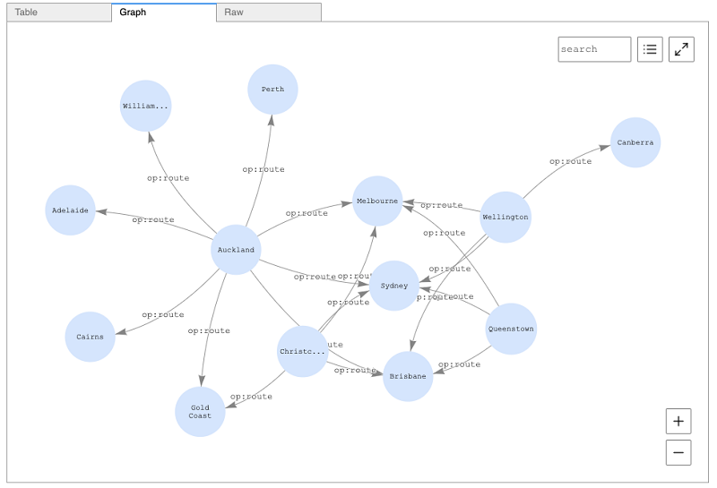

## Welcome to the graph-notebook!


The graph-notebook is an open-source Python package integrating jupyter notebooks with various graph-stores including
[Apache TinkerPop](https://tinkerpop.apache.org/) and [RDF SPARQL](https://www.w3.org/TR/rdf-sparql-query/).



## Requirements
- Python3.6
- Jupyter Notebooks


## Introduction
The graph-notebook provides a way to interact using a Jupyter notebook with any graph database that follows the Gremlin Server or RDF HTTP protocols. These databases could be running locally on your laptop, in a private data center or in the cloud. This project was initially created as a way to work with Amazon Neptune but is not limited to that database engine. For example you can connect to a Gremlin Server running on your laptop using this solution. The instructions below describe the process for connecting to Amazon Neptune. We encourage others to contribute configurations they find useful. There is an `additional-databases` folder where such information can be found. We have already provided instructions for establishing the Gremlin Server connection. Graph-notebook can be used to visualize a variety of use cases including:

| Recommendation engines | Customer identity graphs | Life sciences | Knowledge graphs |
|         :---:          |          :---:           |     :---:     |      :---:       |
|  [](https://aws.amazon.com/blogs/database/using-collaborative-filtering-on-yelp-data-to-build-a-recommendation-system-in-amazon-neptune/)   | [](https://aws.amazon.com/blogs/database/cox-automotive-scales-digital-personalization-using-an-identity-graph-powered-by-amazon-neptune/)  | [](https://aws.amazon.com/blogs/database/zerobase-creates-private-secure-and-automated-contact-tracing-using-amazon-neptune/) |   [](https://aws.amazon.com/blogs/apn/exploring-knowledge-graphs-on-amazon-neptune-using-metaphactory/)   |

## Installation

```
# install the package
pip install graph-notebook

# install and enable the visualization widget
jupyter nbextension install --py --sys-prefix graph_notebook.widgets
jupyter nbextension enable  --py --sys-prefix graph_notebook.widgets

# copy static html resources
python -m graph_notebook.static_resources.install
python -m graph_notebook.nbextensions.install

# copy premade starter notebooks
python -m graph_notebook.notebooks.install --destination /notebook/destination/dir  

# start jupyter
jupyter notebook /notebook/destination/dir
```

## Configuration

In order to connect to your graph database, you have three configuration options.

1. Change the host setting in your opened jupyter notebook by running the following in a notebook cell:

```
%graph_notebook_host you-endpoint-here
```

2. Change your configuration entirely grabbing the current configuration, making edits, and saving it to your notebook by running the following cells:

```
# 1. print your configuration
%graph_notebook_config

# default config will be printed if nothing else is set:
{
    "host": "change-me",
    "port": 8182,
    "auth_mode": "DEFAULT",
    "iam_credentials_provider_type": "ROLE",
    "load_from_s3_arn": "",
    "ssl": true,
    "aws_region": "us-east-1"
}

# 2. in a new cell, change the configuration by using %%graph_notebook_config (note the two leading %% instead of one)
%%graph_notebook_config
{
  "host": "changed-my-endpoint",
  "port": 8182,
  "auth_mode": "DEFAULT",
  "iam_credentials_provider_type": "ENV",
  "load_from_s3_arn": "",
  "ssl": true,
  "aws_region": "us-east-1"
}
```

3. Store a configuration under ~/graph_notebook_config.json
```
echo "{
  "host": "changed-my-endpoint",
  "port": 8182,
  "auth_mode": "DEFAULT",
  "iam_credentials_provider_type": "ENV",
  "load_from_s3_arn": "",
  "ssl": true,
  "aws_region": "us-east-1"
}" >> ~/graph_notebook_config.json
```

### Connecting to a local graph store
As mentioned in the introduction, it is possible to connect `graph-notebook` to a graph database running on your local machine. An example being Gremlin Server. There are additional instructions regarding the use of local servers in the `additional-databases` folder.

## Authentication

If you are running a SigV4 authenticated endpoint, ensure that the config field `iam_credentials_provider_type` is set
to `ENV` and that you have set the following environment variables:

- AWS_ACCESS_KEY_ID
- AWS_SECRET_ACCESS_KEY
- AWS_REGION
- AWS_SESSION_TOKEN (OPTIONAL. Use if you are using temporary credentials)


## Security

See [CONTRIBUTING](https://github.com/aws/graph-notebook/blob/main/CONTRIBUTING.md) for more information.

## License

This project is licensed under the Apache-2.0 License.
